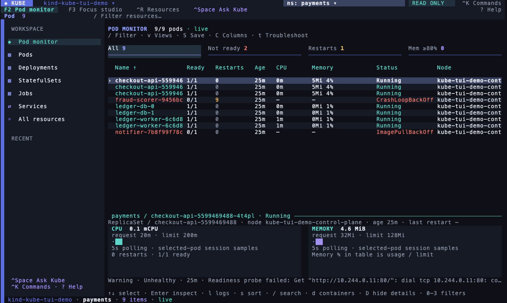

<p align="center">
  
</p>

<p align="center">
  
  
  
  
  
</p>

<p align="center"><b>A fast Kubernetes terminal explorer: live pods, logs and troubleshooting, with keyboard and mouse, in Rust.</b></p>

<p align="center">
  
</p>

## ⚡ Quick start

```sh
cargo install --path . --locked

kube                                 # current kubeconfig context and namespace
kube -n payments                     # one namespace
kube -A                              # all namespaces
kube --kubeconfig ~/clusters.yaml --context production
```

Uses `KUBECONFIG` or `~/.kube/config` by default. Repeat `--kubeconfig` to merge files. No agent installs in the cluster. Exec and port-forward need `kubectl` on PATH; CPU/memory needs metrics-server.

## ✨ What you get

<table>
<tr>
<td width="50%">🩺 <b>Pod monitor</b> <code>F2</code><br>Flat table, live readiness/restarts/CPU/mem, detail dock, 5s refresh, 60-sample local trends.</td>
<td width="50%">🧭 <b>Focus studio</b> <code>F3</code><br>Resource browser with rail + inspector. <code>Ctrl-R</code> opens the full discovered API catalog, CRDs included.</td>
</tr>
<tr>
<td width="50%">📜 <b>Logs that read well</b><br>JSON message view, fold/unfold repeats and stack frames, search, up to 16 streams merged, export.</td>
<td width="50%">🔍 <b>Troubleshooting evidence</b> <code>t</code><br>Waiting/termination states, conditions and up to 32 UID-scoped events, warnings first, sources cited.</td>
</tr>
<tr>
<td width="50%">🎯 <b>Queries &amp; saved views</b><br>AND-combined query language over restarts, readiness, CPU/mem, age, labels. Save views, toggle columns.</td>
<td width="50%">🧠 <b>Ask Kube</b><br>Local, optional AI drawer. Type what you want, review the proposed action, hit Enter. Read-only.</td>
</tr>
</table>

```text
restarts>3 ready=false label:app=payments
cpu>=500m memory>128Mi age<2h
status=CrashLoopBackOff label:tier!=batch
```

## ⌨️ Shortcuts

Press `?` in-app any time for the full list.

**Navigate**

| Key | Action |
| --- | --- |
| `F2` / `F3` | Pod monitor / Focus studio |
| `Tab` / `Shift-Tab`, `j`/`k` | Switch pane and move |
| `Enter`, double-click | Inspect selection |
| `:` / `Ctrl-K` | Command palette |
| `Ctrl-O` / `Ctrl-N` | Cluster / namespace picker |
| `l` / `r` | Logs / related resources |
| `Esc` | Back or close |
| `q` / `Ctrl-C` | Close inspector / quit |

**Pod monitor**

| Key | Action |
| --- | --- |
| `0`–`3` | All / not ready / restarts / high memory |
| `/` | Query bar (fuzzy + AND filters) |
| `d` / `D` | Container & probe details / dock on-off |
| `v` / `S` / `C` | Saved views / save view / columns |
| `t` | Troubleshooting evidence |
| `s` | Sort column and direction |

**Inspector & logs**

| Key | Action |
| --- | --- |
| `1`–`6` | Overview / YAML / Events / Logs / Related / Metrics |
| `z` | Maximize / restore inspector |
| `v` / `w` | Fold-unfold repeats / wrap toggle |
| `/`, `n`/`N`, `F` | Search, next/prev match, matches-only |
| `f` / `c` / `p` | Follow-pause / cycle container / previous instance |
| `J` / `e` / `y` | Pretty JSON / export / clipboard |

**Operations**

| Key | Action |
| --- | --- |
| `:write` / `:readonly` | Enable / disable mutating commands |
| `:scale N` / `:restart` / `:delete` | Scale, restart, delete (typed confirm) |
| `:exec [CONTAINER]` | Interactive shell in a pod |
| `:forward 8080:80` | Port-forward, localhost only |

## 🛡️ Safe by default

- Starts **read-only**. Nothing mutates until you type `:write`.
- Mutations (`:scale`, `:restart`, `:delete`) require typing the resource name, plus UID and resource-version checks so you never hit a replacement resource by accident.
- Secret data and last-applied annotations are redacted in YAML, copy and export.
- Port-forwards bind to `localhost` only and stop when the app exits.

## 🧠 Ask Kube (optional local AI)

`Ctrl-Space`, click **Ask Kube**, or `:ask`. Try `show failing pods in payments`, `why is this deployment stuck?`, or `switch to staging`. Review the proposed action, cluster and scope, then Enter applies it.

The optional **AI edition** bundles the pretrained **Qwen3.5-2B Q4_K_M** (~1.28 GB) with the native llama.cpp CPU runtime. No cloud, no API key, no Python, no Ollama. It only reads and navigates: mutations still go through explicit commands. Still **experimental**. Details, evaluation results and setup: [ai/README.md](ai/README.md).

<details>
<summary>Package the AI bundle from source</summary>

```sh
cargo build --release --locked
python3 scripts/package-ai.py target/release --platform macos-arm64  # or ubuntu-x64
KUBE_AI_DIR="$PWD/target/release/ai" cargo run --locked --example assistant-eval
```

</details>

<details>
<summary>🔧 Development</summary>

```sh
cargo fmt --check
cargo clippy --all-targets --locked -- -D warnings
cargo test --locked && cargo build --locked
```

Live cluster acceptance uses an isolated kind fixture:

```sh
export KUBECONFIG="$PWD/acceptance-kubeconfig.yaml" CLUSTER=kube-tui-acceptance
bash scripts/dev-cluster.sh
cargo test --locked --test integration_kind -- --ignored
python3 scripts/tui-cluster-smoke.py target/release/kube --stress
```

More detail, performance notes and measured results: [docs/IMPLEMENTATION.md](docs/IMPLEMENTATION.md).

</details>

<p align="center">Built with Rust, Ratatui and kube-rs · design cues from the <a href="https://ratatui.rs/showcase/apps/">Ratatui showcase</a></p>
