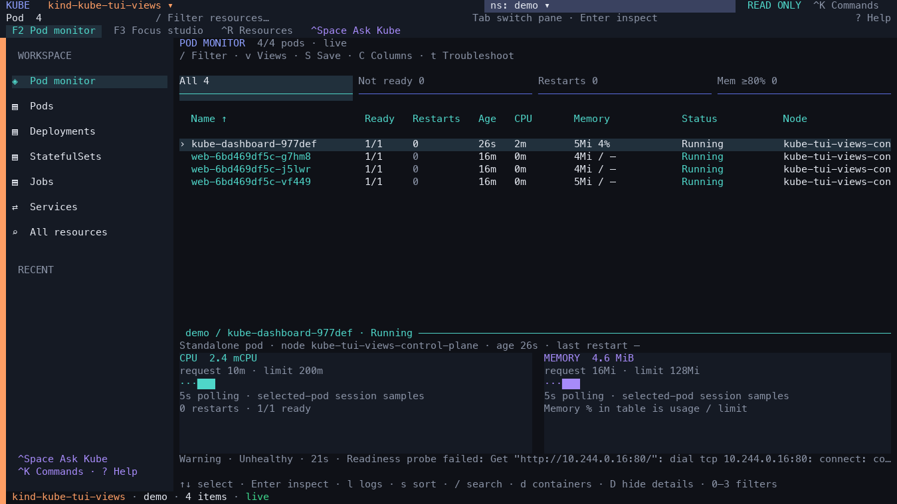

# kube

A fast Kubernetes terminal explorer with keyboard and mouse navigation, live workload logs, resource relationships, and explicitly confirmed operations. Rust + Ratatui + kube-rs.

```sh
cargo install --path . --locked
kube                   # current kubeconfig context and namespace
kube -n payments       # one namespace
kube -A                # all namespaces
kube --kubeconfig ~/clusters.yaml  # your multi-cluster YAML file
kube --kubeconfig ~/clusters.yaml --context production
```

Uses `KUBECONFIG` or `~/.kube/config` by default. `--kubeconfig PATH` overrides that source; repeat the flag to merge files. The cluster picker lists the file’s **contexts** (cluster + credentials + optional namespace). Switching contexts does not modify the file or its `current-context`. Exec and port-forward use the same selected configuration. No agent or service needs installing in the cluster. Normal browsing needs only the Kubernetes API. Exec and port-forward use `kubectl` on PATH. CPU/memory inspection uses metrics-server when available.

## Workspace

Pod monitor opens with a flat pod table and a detail dock for the selected pod. Counts come from the current watch in the selected scope; running pods without readiness evidence are shown as unknown.

`F2` opens Pod monitor. `F3` opens Focus studio, the resource browser. The compact rail contains common workloads and recent investigations; `Ctrl-R` or **All resources** opens the full discovered API catalog, including CRDs. `Tab` moves between the rail, resource list and inspector. The inspector adds readiness and owner context with direct Events, Logs and Related tabs. Cluster and namespace selectors stay visible throughout. Tables hide the API’s optional wide columns on smaller terminals to leave more room for resource names.


## Pod monitor

`F2` shows individual pods with readiness, status, restarts, age, CPU, memory and node. There is no pod grouping. Arrow keys or a click select a pod; Enter inspects it and `l` opens its logs. `s` chooses a column and direction; clickable headers toggle sorting. Selection follows the pod's namespace, name and UID when rows reorder.

The top filters show All (`0`), Not ready (`1`), Restarts (`2`) and memory usage at least 80% of limit (`3`). `/` searches names and labels. `0` clears both the health filter and search. Missing metrics or limits never count as high memory.

The detail dock shows owner, node, age, last restart, termination reason, CPU/memory requests and limits, and trends for the selected pod. `D` hides/shows the dock. `d` switches to container usage, uptime, readiness, images and configured liveness/readiness/startup probes. Probe configuration is not a live liveness measurement; recent Kubernetes warning events show observed failures. Enter opens the full inspector and event history.

Usage refreshes every five seconds while the monitor is visible and retains up to 60 session samples. Selecting a different pod or switching namespace/cluster clears its history and cancels old event requests. Metrics-server and read access to `pods.metrics.k8s.io` are required for consumption data. Missing, denied or stale measurements display as unavailable; gaps are not fabricated as zero. Memory percentages use the pod-level limit when set, otherwise the sum of application and restartable-sidecar limits; incomplete limits display as unknown. Request/limit totals exclude one-shot init containers. Charts show local session history, not historical monitoring.



## Investigate

Select a Deployment and press Enter. The inspector provides Overview, YAML, Events, Logs, Related, and Metrics views. Related follows owner UIDs and selectors to ReplicaSets, Pods, containers, Services, EndpointSlices, nodes and storage. Select a related resource to keep investigating. Discovered custom resources use the server's printer columns and remain browsable without plugins.

Structured JSON logs open in a message view with explicit severity badges and compact timestamps. Click a record or press Enter to expand its JSON details; J toggles formatted JSON and o toggles the original record. Search automatically reveals full records so hidden metadata stays searchable; exports preserve the originals. Repeated single-container source labels move to the toolbar.

Logs open in a wide reading pane; `z` expands the inspector across the terminal. Long messages wrap by default, including Unicode and long JSON fields. Search highlights matching text while keeping surrounding lines visible; `F` switches to matching lines only. Compact timestamps and container labels leave room for the actual message. Consecutive repeated messages and Java-style stack frames collapse into expandable groups (`v` toggles folding). Search automatically expands groups, and copy/export retain every raw record.

Logs aggregate up to 16 pod/container streams, include source labels and timestamps, and follow replacement pods. Choose a container, inspect previous-container logs, search literal text or `re:patterns`, pause/follow, choose a time window, and export the filtered buffer. Kubernetes only exposes retained container logs; this is not a historical logging backend. Reconnect deduplication is best effort for identical timestamps.

## Controls

| Key | Action |
| --- | --- |
| `F2` / `F3` | Pod monitor / Focus studio |
| `0`–`3` on Pod monitor | All / not ready / restarts / high memory |
| `d` / `D` on Pod monitor | Container/probe details / hide or show dock |
| `Ctrl-R` / All resources | Toggle the complete API resource catalog |
| `:` / `Ctrl-K` / click Commands | Searchable command palette |
| `?` | Help |
| `s` / `:sort` | Choose a sort column and direction; click a column header to toggle |
| `/` | Fuzzy resource filter; combine with `label:app=api` or `label:tier!=batch` |
| `Tab` / `Shift-Tab`, arrows, `j`/`k` | Switch pane and navigate |
| `Enter`, double-click | Inspect selection |
| `Ctrl-O` / `Ctrl-N`, or click top-bar selectors | Cluster / namespace picker from any pane |
| `c` / `n` in resource browser | Cluster / namespace picker |
| `l` / `r` | Logs / related resources |
| `1`–`6`, or click inspector tabs | Inspector views |
| `z` in inspector | Maximize / restore |
| `[` / `]`, `b` | Resize / collapse sidebar |
| Drag pane divider | Resize sidebar or inspector |
| `m` | Toggle mouse capture for native terminal copying |
| `Ctrl-U` in resource filter | Clear query |
| `Esc` | Close or go back; does nothing at the root |
| `q` | Close inspector; quit from the resource browser |
| `Ctrl-C` | Quit |

Sorting uses elapsed time for age (including compound values such as 2d3h), numerical restart counts (including last-restart annotations), and alphabetical names. The active header shows ↑ or ↓.

Inspector actions are clickable. Logs: `v` fold/expand repeated messages and stack frames; `w` wrap on/off; `←`/`→` pan unwrapped lines; `/` or `Ctrl-F` search; `n`/`N` next/previous matching line; `F` matching lines/context; `Ctrl-U` clear an editing query; `Esc` cancel editing or clear a committed search; `Home` oldest retained line; `End` live tail; `f` pause/follow; `c` cycle containers; `p` previous instance; `s` time window; `J` pretty JSON; `e` export; `y` clipboard. Exports create a new file and never overwrite an existing file. Clipboard uses `pbcopy` on macOS or `xclip` on Linux. Pane sizes and mouse preference are saved to `$XDG_CONFIG_HOME/kube/preferences.json` (normally `~/.config/kube/preferences.json`).

## Ask Kube (optional local AI)

Press `Ctrl-Space`, click **Ask Kube**, or enter `:ask`. Try `show failing pods in payments`, `show deployments`, `previous logs for this pod`, `why is this deployment stuck?`, or `switch to staging`. Review the displayed cluster, namespace, selected resource and proposed action, then press Enter to apply. Esc cancels. This path only reads and navigates; existing explicit commands handle mutations.

Common phrases work immediately in the standard binary. The optional **AI edition** bundles the pretrained **Qwen3.5-2B Q4_K_M** model (1,280,835,840 bytes, about 1.28 GB) and the native llama.cpp CPU runtime. **No training, Python service, Ollama installation, API key or cloud connection is needed.** Extract the whole archive and run `./kube`, keeping the adjacent `ai/` directory. Source, prompt, schema, evaluations and pinned checksums live in Git; model weights and native runtime live in the optional release archive.

`Ctrl-Space`, **Ask Kube**, or `:ask` opens it. With the bundle discovered, the title says **local model available**. For a source build, assemble the bundle beside `target/release/kube`, or set `KUBE_AI_DIR=/absolute/path/to/ai`. Restart the app after installing/upgrading the bundle. Old FunctionGemma bundles must be replaced with the new bundle; the app checks protocol compatibility. The built-in commands continue to work without one.

Try natural phrasing such as “Could you bring up unhealthy pods in orders?”, “I want the manifest of the selected deployment”, “Show me CPU and memory usage for this pod”, or “Change context to Team-East”. Review the proposed action and scope, then Enter applies it. This is a **read-only navigation assistant**, not an autonomous operator or root-cause generator. Named-pod targets, compound actions and unsupported list conditions are rejected; select a resource before asking about “this pod”. Use the table's sorting/filter controls for metric thresholds and ordering.

Local suggestions remain **experimental**: small pretrained models can misinterpret a request, and a limited evaluation suite cannot establish general accuracy. Only the typed request and fixed action definitions reach the local worker. It starts on demand with two CPU threads, a 4,096-token context and a 60-second overall deadline, then exits; the TUI remains responsive. Cold interpretation takes several seconds and varies by machine. See [AI setup, limitations and measured results](ai/README.md).

ONNX Runtime can also run pretrained models without training. This distribution uses the tested GGUF/native CPU path; converting to ONNX alone would not improve interpretation accuracy.

To assemble the optional distribution (network needed **at packaging time**):

```sh
cargo build --release --locked
mkdir package
cp target/release/kube package/
python3 scripts/package-ai.py package --platform macos-arm64  # or ubuntu-x64
KUBE_AI_DIR="$PWD/package/ai" cargo test --locked --test assistant_local -- --ignored
cargo run --locked --example assistant-eval
```

The packager verifies pinned SHA-256 hashes and the model size budget and includes the model/runtime licenses. The **Build binaries** workflow has an `include_ai` option to produce both editions. `cargo run --example assistant-eval -- --model-only` measures raw model accuracy separately; failures are expected with the current experimental model and are documented in [ai/README.md](ai/README.md).


## Operations

Starts read-only. `:write` enables confirmations; `:readonly` disables them. `:scale 3`, `:restart`, and `:delete` show the cluster, namespace, resource and operation, and require typing the resource name. UID checks prevent changing a replacement resource; resource-version preconditions protect concurrent changes. Changing context resets write mode.

Select a Pod and use `:exec` (or `:exec CONTAINER`) for an interactive shell. `:forward 8080:80` binds only to localhost; `:stop-forwards` stops this application's forwards. Forwards stop when the application exits or the context changes.

Secret data and last-applied Secret annotations are redacted in YAML, copy and export. Auth-plugin failures do not print credential output. Logs may contain application-emitted sensitive data and are shown as received, with terminal control characters removed.

## Performance and limits

Pods begin loading while API discovery runs. Resource kinds are watched on demand; eight recently visited kinds remain warm. Older watches and caches are evicted. Watch notifications coalesce before queuing, input is processed in bounded batches, and the table formats visible rows. Selection follows resource identity across updates.

Each log view retains at most 100,000 lines and 32 MiB of text/source payload, with a 64 KiB line cap and a bounded stream queue. The status line reports evicted lines. Total process memory additionally includes resource caches and runtime/UI overhead; caches grow with the resources in the watched scopes.

Run `cargo bench --locked --bench responsiveness` for repeatable synthetic performance checks. Local acceptance results and limitations are in [docs/IMPLEMENTATION.md](docs/IMPLEMENTATION.md).

## Development and acceptance

```sh
cargo fmt --check
cargo clippy --all-targets --locked -- -D warnings
cargo test --locked
cargo build --locked
python3 scripts/terminal-smoke.py
cargo bench --locked --bench responsiveness
```

Live tests must use the isolated kind fixture:

```sh
export KUBECONFIG="$PWD/acceptance-kubeconfig.yaml"
export CLUSTER=kube-tui-acceptance
bash scripts/dev-cluster.sh
cargo test --locked --test integration_kind -- --ignored
python3 -m pip install -r scripts/requirements-test.txt
python3 scripts/tui-cluster-smoke.py
cargo build --release --locked
python3 scripts/tui-cluster-smoke.py target/release/kube --stress
python3 scripts/tui-ux-smoke.py target/release/kube
bash scripts/dev-metrics.sh  # disposable kind fixture only
python3 scripts/dashboard-smoke.py target/release/kube
```

This creates a `demo` namespace, nginx deployment and restricted ServiceAccount. Tests create/delete their own fixture resources. CI runs unit/render/terminal tests on Linux and macOS and Kubernetes acceptance on Linux. The binary workflow produces Linux x86-64 and macOS ARM64 archives with checksums on version tags or manual dispatch.

The visual design takes cues from [Ratatui’s app showcase](https://ratatui.rs/showcase/apps/): visible keyboard actions, distinct pane focus, compact metadata, and a dedicated reading area. Set `KUBE_UI_CAPTURE_DIR` when running the UX smoke test to save terminal-cell snapshots for visual review.
